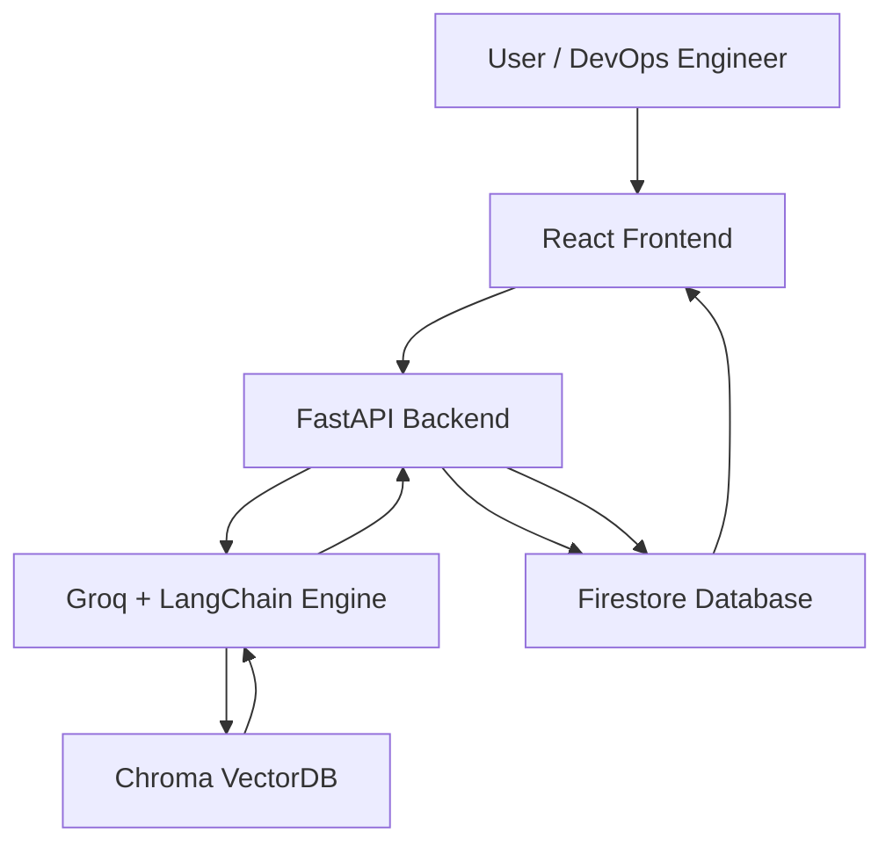

# 🧠 Anamoli AI — AI-Powered Observability Platform

**Anamoli AI** is an intelligent observability system that leverages **LLMs (Groq)**, **LangChain**, **RAG (Retrieval-Augmented Generation)**, and **Vector Databases (Chroma)** to analyze logs, detect anomalies, and enable conversational queries about your systems — all integrated with **Firestore** and a **React frontend**.

---

## 🚀 Project Summary

Modern distributed systems produce millions of logs daily. Finding anomalies and understanding root causes manually is slow and error-prone.

**Anamoli AI** automates observability through:

- 🧩 **AI-powered log parsing and anomaly detection**  
- 🔍 **Semantic search & RAG-based reasoning**  
- 💬 **Conversational interface for querying system health**  
- 📊 **Firestore-based real-time updates**

This allows DevOps and engineers to **chat with their infrastructure** for insights and resolutions in real time.

---

## ⚙️ How to Run the Project

### 🧩 Backend — FastAPI + LangChain + Groq

#### 1️⃣ Create Virtual Environment
```bash
cd backend
python3 -m venv venv
source venv/bin/activate
pip install -r requirements.txt
```

#### 2️⃣ Create `.env` File and Configure service account key for firestore
Inside `backend/`:

```env
GROQ_API_KEY=your_groq_api_key
GROQ_MODEL=openai/gpt-oss-20b
GROQ_EMBED_MODEL=nomic-embed-text-v1.5
GOOGLE_APPLICATION_CREDENTIALS=firestore-service-key.json
CHROMA_PATH=./chroma_store
```

Inside `backend/`:
There is a file named by firestore-service-key.json: 
```
You need to add the service account key json details for configuring firestore operations in your backend
```

#### 3️⃣ Run the Server
```bash
uvicorn main:app --reload
```

Backend runs on:
📍 **http://127.0.0.1:8000**

---

### 💬 Frontend — React + Firestore

#### 1️⃣ Install Dependencies
```bash
cd frontend
npm install
npm start
```

Frontend runs on:
📍 **http://localhost:3000**

#### 2️⃣ Configure Firebase
In `/frontend/src/firebaseConfig.js`:

```js
import { initializeApp } from "firebase/app";
import { getFirestore } from "firebase/firestore";

const firebaseConfig = {
  apiKey: "your-api-key",
  authDomain: "your-app.firebaseapp.com",
  projectId: "your-project-id",
  storageBucket: "your-app.appspot.com",
  messagingSenderId: "your-sender-id",
  appId: "your-app-id"
};

const app = initializeApp(firebaseConfig);
export const db = getFirestore(app);
```

---

## 🧠 System Architecture Overview



### 🧩 Components Overview

| Layer                  | Description                                                              |
| ---------------------- | ------------------------------------------------------------------------ |
| **Frontend (React)**   | Interactive chat + real-time updates from Firestore                      |
| **Backend (FastAPI)**  | Core logic for RAG, log processing, and LLM orchestration                |
| **LLM (Groq)**         | Detects anomalies and explains system issues                             |
| **Vector DB (Chroma)** | Embedding-based retrieval for contextually relevant log data             |
| **Firestore**          | Stores structured logs, anomalies, and user conversations                |

---

## 🔍 End-to-End Flow

### 1️⃣ Log Generation
**Endpoint:** `/fetch_and_store_logs`

- Generates realistic logs using **Groq LLM**.  
- Logs include mixed levels: `INFO`, `WARN`, `ERROR`, etc.

Example:
```
[2025-10-12T05:12:34Z] [ERROR] PaymentProcessor: NullPointerException while executing transaction ID 8392
```

---

### 2️⃣ Log Parsing & Embedding
**Endpoint:** `/store_logs`

1. Groq LLM + **PydanticOutputParser** parses raw logs into structured format:
   ```json
   {
     "timestamp": "2025-10-12T05:12:34Z",
     "log_level": "ERROR",
     "service_name": "PaymentProcessor",
     "error_code": "NPE8392",
     "message": "NullPointerException while executing transaction ID 8392"
   }
   ```
2. The message is embedded using **HuggingFace Sentence Transformers** (`all-MiniLM-L6-v2`).
3. Stored in:
   - 🧠 **Chroma VectorDB** — embeddings for semantic search  
   - 🔥 **Firestore** — structured log storage

---

### 3️⃣ Anomaly Detection
After storage:
- **Groq LLM** analyzes recent logs.
- Detects anomalies, probable causes, and recommends actions.

Example:
```json
{
  "summary": "High latency detected in AuthService",
  "detected_anomalies": ["Memory Leak", "Slow Response"],
  "probable_causes": ["Thread blocking in API handler"],
  "severity_level": "Critical",
  "recommended_action": "Restart AuthService and run profiling."
}
```

---

### 4️⃣ Conversational AI — Retrieval-Augmented Generation (RAG)
**Endpoint:** `/ask_ai`

Query example:
> “Why are there so many 500 errors in the BillingAPI logs?”

Flow:
1. Retrieve relevant log embeddings from **Chroma**.
2. Fetch recent conversation context from **Firestore**.
3. Construct contextual prompt:
   ```
   Summary: Past issues with DB timeouts
   Logs: [...retrieved logs...]
   Question: Why did 500 errors spike?
   ```
4. Send to **Groq LLM**.
5. LLM responds:
   ```
   The spike in 500 errors was caused by database connection pool exhaustion between 3:20–3:45 AM.
   Increasing pool size should resolve the issue.
   ```

---

### 5️⃣ Conversation Management

Conversations are stored like this:
```
user_conversations/
 └── {username}/
      └── tenants/{tenant_id}/apps/{app_id}/conversations/{convo_id}/messages/
           ├── user: "Why are there errors?"
           ├── assistant: "Database pool exhausted."
```

When message history grows, older logs are summarized automatically to maintain context — **context window optimization**.

---

## 🧱 Firestore Schema

| Path                                                  | Purpose                           |
| ----------------------------------------------------- | --------------------------------- |
| `/logs/{tenant_id}/{app_id}`                          | Structured log entries            |
| `/anomalies/{tenant_id}/{app_id}`                     | Detected anomalies                |
| `/user_conversations/{username}/{tenant_id}/{app_id}` | Chat history                      |
| `/chroma_store/`                                      | Local vector embeddings directory |

---

## 🧩 How RAG Works

```text
[User Query] → [Retriever: Chroma] → [Relevant Logs]
         ↓
   [Groq LLM: Reasoning + Contextual Understanding]
         ↓
[Contextual Answer Grounded in Actual Logs]
```

**Pipeline:**
1. Retrieve top-K relevant log embeddings from **Chroma**.
2. Combine with chat history and context.
3. Pass into **Groq model** for grounded reasoning.

This ensures **zero hallucination** and **true log-grounded responses**.

---

## 🧰 Tech Stack

| Layer            | Technologies                                                   |
| ---------------- | -------------------------------------------------------------- |
| **Frontend**     | React.js, Axios, Firestore (Realtime)                          |
| **Backend**      | FastAPI, LangChain, Groq LLM, Pydantic, HuggingFace Embeddings |
| **Database**     | Firestore                                                      |
| **Vector Store** | Chroma                                                         |
| **LLM**          | Groq `llama3-70b-8192`                                         |
| **Embeddings**   | Sentence Transformers (`all-MiniLM-L6-v2`)                     |
| **Language**     | Python 3.11, Node.js 18+                                       |

---

## 📊 Dashboard Features

1. **Recent Logs Table**
   - Displays structured logs for each tenant/app.

2. **Anomaly Trend Chart**
   - Visualizes anomaly frequency and severity over time.

3. **Conversational Chat Panel**
   - Real-time AI chat using Groq LLM for insights.

4. **Live Sync**
   - Uses Firestore `onSnapshot()` for instant message updates.

---

## 🧭 Future Enhancements

- [ ] Automated log ingestion CRON (every 5 mins)
- [ ] WebSocket streaming for LLM responses
- [ ] Multi-tenant analytics dashboard
- [ ] Integration with Prometheus/Grafana metrics
- [ ] Enhanced RAG summarization + memory compression

---

## 🧩 API Endpoints Summary

| Method | Endpoint                 | Description                           |
| ------- | ------------------------ | ------------------------------------- |
| `POST` | `/fetch_and_store_logs`  | Generate and store synthetic logs     |
| `POST` | `/store_logs`            | Parse, embed, and detect anomalies    |
| `POST` | `/ask_ai`                | Conversational insights via Groq LLM  |
| `GET`  | `/analyze`               | Retrieve past anomaly reports         |

---

## 👨‍💻 Author

**Biswajeet Raut**  
*Full Stack & AI Engineer*  
🚀 Building intelligent backend systems merging LLMs with observability.  
📧 [biswajeetraut382@gmail.com](mailto:biswajeetraut382@gmail.com)

---

## 📜 License

Licensed under the **MIT License** — free to use, modify, and distribute.

---

## ✅ Quick Recap

Anamoli AI is your **self-learning observability assistant** — it:
- Understands logs 🧩  
- Detects anomalies ⚠️  
- Learns from incidents 📖  
- Chats about your system health 💬  

**Built with 💙 using FastAPI, LangChain, Groq, Firestore & React.**
